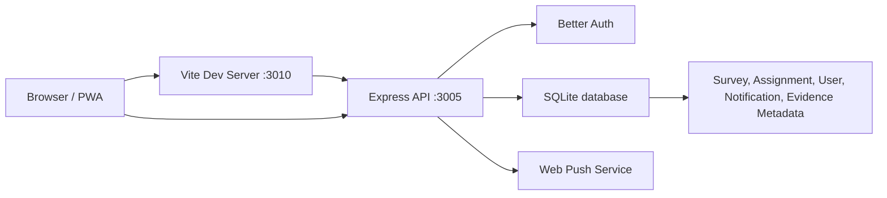

# KLWT Field Force

Professional field-force survey, verification, and merchant intelligence application for the Polibeli KLWT cooling parts campaign.

The application supports end-to-end operational workflows: visit planning, surveyor submission, GPS and photo evidence validation, verifier review, duplicate detection, notification inbox, PWA push notifications, dashboard analytics, and structured data operations.

## Table of Contents

- [Overview](#overview)
- [Core Features](#core-features)
- [Tech Stack](#tech-stack)
- [Architecture](#architecture)
- [Project Structure](#project-structure)
- [Prerequisites](#prerequisites)
- [Environment Variables](#environment-variables)
- [Getting Started](#getting-started)
- [Demo Accounts](#demo-accounts)
- [Useful Scripts](#useful-scripts)
- [Data and Seeding](#data-and-seeding)
- [Verification Workflow](#verification-workflow)
- [PWA Push Notifications](#pwa-push-notifications)
- [Testing and Build](#testing-and-build)
- [Troubleshooting](#troubleshooting)
- [Production Checklist](#production-checklist)

## Overview

KLWT Field Force is built for a multi-role sales and survey operation across Java, with stronger coverage around DKI Jakarta and East Java/Surabaya. It combines survey execution, data quality controls, verifier workflows, duplicate review, map previews, and management dashboards in a single web application.

Primary roles:

- **Head**: national dashboard, market intelligence, exports, and overall performance review.
- **Manager**: team progress, visit planning, assignment monitoring, and area-level follow-up.
- **Surveyor**: daily visit plan, GPS capture, survey form, photo evidence, and revision handling.
- **Verificator**: verification desk, warning queue, duplicate merge review, contact validation, and verification history.
- **Administrator**: user management, data operations, imports, exports, and system oversight.

## Core Features

- Role-based navigation and access control.
- Professional dashboard with survey trend, lead mix, supplier signals, and field team progress.
- Time-series analytics from backend data with surveyor filtering and run-rate/target mode.
- Visit assignment and planned/unplanned store capture.
- GPS capture with province/city/district/village enrichment from master location data.
- Interactive map preview with zoom, pitch, and Google Maps handoff.
- Structured survey form with required/optional indicators and multi-select question hints.
- Photo evidence management for storefront, interior/rack, and PIC/customer context.
- Verification desk grouped by surveyor with lazy-loaded store lists.
- Verification history with annul workflow to return incorrect decisions to the queue.
- Duplicate detection based on store name, WhatsApp number, city, district, village, address, and coordinates.
- Contact validation checklist for phone call and WhatsApp reachability.
- Notification inbox, read/unread lifecycle, and optional PWA push notifications.
- Data operations hub for import/export, health checks, and operational activity.

## Tech Stack

- **Frontend**: React 19, TypeScript, Material UI, Vite.
- **Backend**: Express, TypeScript, Better Auth, Drizzle ORM.
- **Database**: SQLite via `better-sqlite3`.
- **PWA**: Web manifest, service worker, web-push.
- **Testing**: Jest, React Testing Library, Supertest.
- **Build Tooling**: Vite, TypeScript project references.

## Architecture



Development runs two processes:

- Web app: `http://127.0.0.1:3010`
- API server: `http://127.0.0.1:3005`

The Vite dev server proxies `/api` calls to the API server.

## Project Structure

```text
.
├── public/                      # PWA manifest, service worker, public logo assets
├── scripts/                     # Location import, realistic reseed, duplicate QA data scripts
├── src/
│   ├── components/              # Reusable frontend components
│   ├── server/                  # Express routes, auth, database, seed, push notifications
│   ├── utils/                   # Utility modules such as XLSX helpers
│   ├── App.tsx                  # Main application shell and role screens
│   ├── api.ts                   # Typed API client
│   ├── styles.css               # Application styling
│   └── verificationLogic.ts     # Shared duplicate and verification logic
├── test/                        # Test setup
├── DB Lokasi.csv                # Master location seed source
├── package.json                 # Scripts and dependencies
└── vite.config.ts               # Vite config and API proxy
```

Runtime-generated folders are intentionally ignored:

- `data/`: SQLite database, local VAPID keys, backups.
- `dist/`: production build output.
- `mobile-audit/` and `tmp-mobile-chrome/`: local QA/browser artifacts.

## Prerequisites

- Node.js 22 or newer.
- npm 10 or newer.
- Git.

Check installed versions:

```powershell
node --version
npm --version
git --version
```

## Environment Variables

Copy `.env.example` to `.env` for local customization:

```powershell
Copy-Item .env.example .env
```

Important variables:

| Variable | Required | Description |
| --- | --- | --- |
| `API_PORT` | No | API server port. Defaults to `3005`. |
| `AUTH_BASE_URL` | Production | Public API/auth base URL. |
| `AUTH_TRUSTED_ORIGINS` | Production | Comma-separated allowed frontend origins for auth. |
| `CORS_ORIGINS` | Production | Comma-separated browser origins allowed by the API. |
| `BETTER_AUTH_SECRET` | Production | Strong secret for Better Auth cookies/tokens. |
| `WEB_PUSH_PUBLIC_KEY` | Production push | VAPID public key. |
| `WEB_PUSH_PRIVATE_KEY` | Production push | VAPID private key. |
| `WEB_PUSH_SUBJECT` | Production push | VAPID subject, usually `mailto:...`. |
| `SEED_DEMO_DATA` | Optional | Seeds demo data when set to `true`. |

Never commit real `.env` files or production secrets.

## Getting Started

Install dependencies:

```powershell
npm install
```

Run the full development stack:

```powershell
npm run dev
```

Open:

[http://127.0.0.1:3010](http://127.0.0.1:3010)

The API server starts at:

[http://127.0.0.1:3005](http://127.0.0.1:3005)

## Demo Accounts

Development seeding creates demo users automatically when the database is empty.

| Role | Username | Password |
| --- | --- | --- |
| Head | `head.polibeli` | `head123` |
| Manager | `manager.polibeli` | `manager123` |
| Verificator | `verificator.polibeli` | `verify123` |
| Administrator | `admin.polibeli` | `admin123` |
| Surveyor | `surveyor.polibeli` | `surveyor123` |

These credentials are for local/demo use only. Replace authentication and secrets before production deployment.

## Useful Scripts

| Script | Purpose |
| --- | --- |
| `npm run dev` | Run API and web dev servers together. |
| `npm run dev:api` | Run API server only. |
| `npm run dev:web` | Run Vite web server only. |
| `npm run build` | Type-check and create production build. |
| `npm run test` | Run all tests. |
| `npm run demo:reseed:dry-run` | Preview realistic demo data reseed. |
| `npm run demo:reseed:apply` | Apply realistic demo data reseed. |
| `npm run locations:import:kml` | Import location boundaries from KML source. |
| `node scripts/add-high-duplicate-pending-surveys.mjs` | Add idempotent pending duplicate QA records. |

## Data and Seeding

The app uses SQLite at:

```text
data/klwt-surveyor.sqlite
```

The `data/` folder is ignored by git because it contains runtime data, local secrets, backups, and environment-specific artifacts.

Location seed data comes from:

```text
DB Lokasi.csv
```

For richer demo data:

```powershell
npm run demo:reseed:apply
```

For duplicate-review QA records:

```powershell
node scripts/add-high-duplicate-pending-surveys.mjs
```

That script creates pending verification records with duplicate scores above 70% against existing verified stores.

## Verification Workflow

The verification desk supports:

- Metric cards for unverified queue, active surveyors, warnings, GPS issues, missing photos, and duplicates.
- Surveyor-grouped queue lists with lazy-loaded stores.
- Store detail with photo evidence, map preview, address detail, contact actions, and verifier checklist.
- Decisions: `Verified Valid`, `Need Revision`, `Rejected Invalid`, and `Merge Duplicate`.
- Revision popup with structured instruction back to surveyor.
- Verification history grouped by surveyor.
- Annul action for reversing an incorrect verification decision and returning the survey to the open queue.

Duplicate scoring uses these weighted signals:

| Signal | Weight |
| --- | ---: |
| Store name | 30 |
| WhatsApp number | 25 |
| City | 10 |
| District | 10 |
| Village | 8 |
| Address prefix | 12 |
| Coordinates within 100m | 5 |

Records scoring at least 70% are surfaced as possible duplicates.

## PWA Push Notifications

The application includes PWA push support:

- Push subscription endpoints in the API.
- Runtime VAPID configuration.
- Local development VAPID key generation under `data/`.
- Service worker in `public/push-sw.js`.

For production push notifications, configure:

```text
WEB_PUSH_PUBLIC_KEY
WEB_PUSH_PRIVATE_KEY
WEB_PUSH_SUBJECT
```

## Testing and Build

Run tests:

```powershell
npm run test
```

Run production build:

```powershell
npm run build
```

The build output is written to `dist/` and is ignored by git.

## Troubleshooting

### Port 3005 already in use

If `npm run dev` fails with `EADDRINUSE` for `127.0.0.1:3005`, stop the process using that port:

```powershell
$listeners = Get-NetTCPConnection -LocalPort 3005 -State Listen -ErrorAction SilentlyContinue
foreach ($listener in $listeners) { Stop-Process -Id $listener.OwningProcess -Force }
```

Then run:

```powershell
npm run dev
```

### Port 3010 already in use

```powershell
$listeners = Get-NetTCPConnection -LocalPort 3010 -State Listen -ErrorAction SilentlyContinue
foreach ($listener in $listeners) { Stop-Process -Id $listener.OwningProcess -Force }
```

### Reset local demo database

Stop the dev server, remove `data/klwt-surveyor.sqlite`, then start development again. The database will be recreated and seeded.

## Production Checklist

Before production deployment:

- Set `NODE_ENV=production`.
- Set a strong `BETTER_AUTH_SECRET`.
- Configure strict `AUTH_BASE_URL`, `AUTH_TRUSTED_ORIGINS`, and `CORS_ORIGINS`.
- Configure persistent SQLite storage or migrate to a managed database if required by scale.
- Configure production VAPID keys for PWA push notifications.
- Disable or control demo seeding.
- Use HTTPS for the frontend and API.
- Review cookie security and reverse proxy headers.
- Keep `data/`, `.env`, logs, and generated backups out of version control.
- Run `npm run test` and `npm run build` before release.

## License

Private/internal project unless a separate license file is added.
